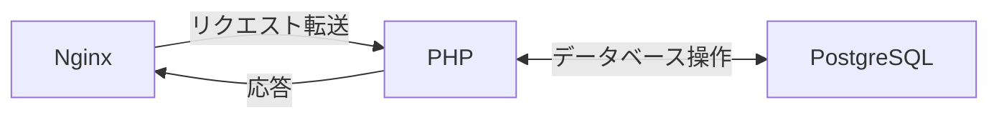
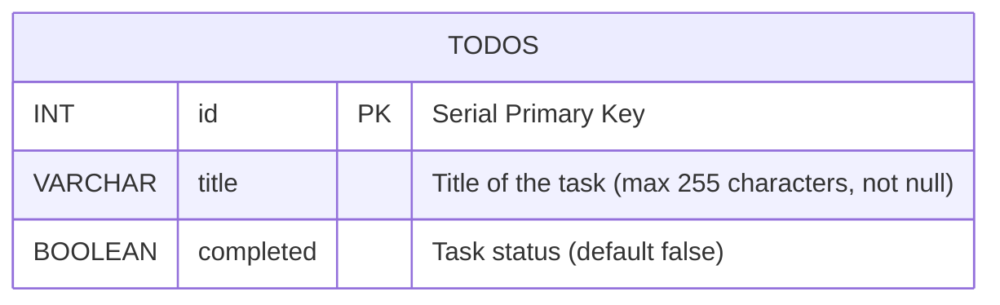

## 0. 課題説明
TODO リストアプリを作成するためのバックエンド開発トレーニングを開始します。このトレーニングでは、PHPとPostgreSQLを使用して、RESTful APIを作成し、データベースとのやり取りを行います。このトレーニングを完了すると、PHPを使用してデータベースと通信する方法を学び、APIエンドポイントを作成する方法を理解することができます。
backend trainingの目標は以下の通りです。
- PHPを使用してRESTful APIを作成する。
- PostgreSQLデータベースとの通信を設定する。
- APIエンドポイントを作成し、データベースとのやり取りを行う。 
- APIエンドポイントをテストし、データベースとの通信を確認する。

構成図：


## 1. 環境設定

-    **Dockerのインストール:** Dockerがインストールされ、実行されていること。([https://www.docker.com/get-started/](https://www.docker.com/get-started/))
-    **Docker Composeのインストール:** Docker Composeがインストールされていること。([https://docs.docker.com/compose/install/](https://docs.docker.com/compose/install/))
-    **コードエディタ/IDEのインストール:** テキストエディタまたはIDE（例: VS Code）がインストールされていること。
-    **プロジェクトへの移動:** ターミナルを開き、`cd backend_tranning/`を使ってプロジェクトのルートディレクトリに移動してください。
-    **プロジェクトファイル:** `compose.yml`、`app/Dockerfile`、`app/src/`、および`nginx/default.conf`ファイルがあることを確認してください。

## 2. Docker Composeの設定

-    **Dockerコンテナの起動:** `docker-compose up -d`コマンドを実行してコンテナを起動します。 
- `docker ps`またはDocker Desktopを使って、コンテナが実行中であることを確認します。

## 3. データベースの設定
- 

### 3.1.A. データベースクライアントで接続する場合
-    **データベースクライアント:** PostgreSQLデータベースクライアント（`pgAdmin`、`DBeaver`など）がインストールされていること。
-    **データベースへの接続:** `compose.yml`ファイルにある以下の接続情報を使って、PostgreSQLデータベースに正常に接続します。
      ```sql
        DATABASE: prtimes
        PORT: 5432
        USERNAME: prtimes
        PASSWORD: prtimes
      ```
### 3.1.B. dockerコンテナ内で接続する場合
-    **`app`コンテナに接続:** `docker exec -it app bash`を使って`app`コンテナに接続します。
-   **`psql`コマンド:** `psql -U prtimes -d prtimes`を使って、PostgreSQLデータベースに接続します。

### 3.2 テーブルの作成
-    **SQLクエリの実行:** 以下のSQLクエリを実行して、`todos`テーブルを作成します。
```sql
CREATE TABLE todos (
    id SERIAL PRIMARY KEY,
    title VARCHAR(255) NOT NULL,
    completed BOOLEAN DEFAULT FALSE
);
```

### 3.3 データの挿入
-    **SQLクエリの実行:** 以下のSQLクエリを実行して、`todos`テーブルにデータを挿入します。
```sql
INSERT INTO todos (title, completed) VALUES ('Todo 1', FALSE);
INSERT INTO todos (title, completed) VALUES ('Todo 2', TRUE);
INSERT INTO todos (title, completed) VALUES ('Todo 3', FALSE);
```

### 3.4 データの確認
**SQLクエリの実行:** 以下のSQLクエリを実行して、`todos`テーブルのデータを確認します。ステップ3.3で挿入したデータが表示されることを確認してください。
```sql
SELECT * FROM todos;
```
以下のような結果が表示されると、OKです。
```bash
 id | title  | completed
----+--------+-----------
  1 | Todo 1 | f
  2 | Todo 2 | t
  3 | Todo 3 | f
(3 rows)
```

## 4. PHP API の開発

1. **`config.php`の作成:**  
   `php/src`ディレクトリに、データベース接続設定を含む`config.php`ファイルを作成します。

2. **`index.php`の作成:**  
   同じディレクトリに`index.php`ファイルを作成し、`/todos`エンドポイントを実装します。 
   <br>全てのコードを`index.php`に書く必要はありません。任意のファイルを作成して、コードを分割することができます。
   <br><br>以下の機能を追加してください：

    - **GET `/todos`（全てのTodoを取得）:**
        - 成功時: HTTPステータスコード`200`で全てのTodoをJSON形式で返します。Todoが存在しない場合、空の配列`[]`を返します。
        - エラー時: HTTPステータスコード`500`でエラーメッセージを`{"error": "エラーメッセージ"}`の形式で返します。

    - **GET `/todos?id={id}`（IDでTodoを取得）:**
        - 成功時: HTTPステータスコード`200`で指定されたIDのTodoをJSON形式で返します。Todoが存在しない場合、空のオブジェクト`{}`を返します。
        - IDが見つからない場合: HTTPステータスコード`404`でエラーメッセージ`{"error": "Todoが見つかりません"}`を返します。
        - エラー時: HTTPステータスコード`500`でエラーメッセージを返します。

    - **POST `/todos`（新しいTodoを作成）:**
        - リクエストボディとして`{"title": "Todoのタイトル"}`のJSONを受け付けます。
        - 成功時: HTTPステータスコード`201`で作成されたTodoをJSON形式で返します。
        - エラー時: HTTPステータスコード`500`でエラーメッセージを返します。

    - **PUT `/todos?id={id}`（IDでTodoを更新）:**
        - リクエストボディで`title`または`completed`ステータスを更新します。
        - 成功時: HTTPステータスコード`200`で更新されたTodoをJSON形式で返します。
        - IDが見つからない場合: HTTPステータスコード`404`でエラーメッセージを返します。
        - エラー時: HTTPステータスコード`500`でエラーメッセージを返します。

    - **DELETE `/todos?id={id}`（IDでTodoを削除）:**
        - 成功時: HTTPステータスコード`200`で削除されたTodoをJSON形式で返します。
        - IDが見つからない場合: HTTPステータスコード`404`でエラーメッセージを返します。
        - エラー時: HTTPステータスコード`500`でエラーメッセージを返します。

3. **アプリコンテナの再起動:**  
   エンドポイントを実装した後、以下のコマンドを実行してアプリコンテナを再起動します：
   ```bash
   docker compose restart app
    ```


## 5. APIのテスト

-    **APIクライアント:** APIクライアント（Postman、Insomniaなど）がインストールされていること。
-    **GET /todos (リスト):** `GET`メソッドを使用して`http://localhost/todos`をテストし、空の配列`[]`が返されることを確認します。
-    **POST /todos (作成):** `POST`メソッドを使用して`http://localhost/todos`をテストし、`{"title": "テストTodo"}`のようなJSONボディを提供します。
    -    新しいアイテムが正しいタイトルでデータベースに作成されたことを確認します。
-    **GET /todos?id={id} (取得):** `GET`メソッドを使用して`http://localhost/todos?id={id}`をテストし、`{id}`を作成済みの`id`に置き換えます。
    -    正しいレコードが返されることを確認します。
-    **PUT /todos?id={id} (更新):** `PUT`メソッドを使用して`http://localhost/todos?id={id}`をテストし、`{id}`を作成済みのidに置き換えます。`title`または`completed`ステータスを更新します。
    -    レコードが正しく更新されることを確認します。
-    **DELETE /todos?id={id} (削除):** `DELETE`メソッドを使用して`http://localhost/todos?id={id}`をテストし、`{id}`を作成済みの`id`に置き換えます。
    -    レコードが正しく削除されることを確認します。

## 6. 開発と反復

-    **PHPコードの変更:** `php/src`ディレクトリ内のファイルを編集します。
-    **コンテナの再起動:** `docker-compose restart app`を使用して、PHPコードを変更した後にコンテナを再起動します。
-    **APIの再テスト:** 変更ごとにAPIクライアントを使用してエンドポイントを再テストします。

## 7. クリーンアップ
-    **コンテナの停止:** `docker-compose stop`コマンドを実行してコンテナを停止します。

## おめでとうございます！

Todoリストアプリのチュートリアルを正常に完了しました！ メインのチュートリアルページにある「さらに探索」セクションを自由に探索して、アプリをさらに改善してください。
