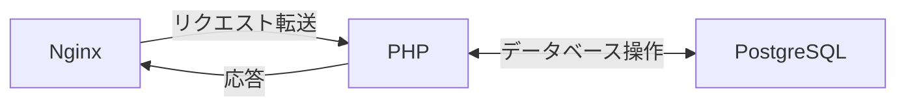
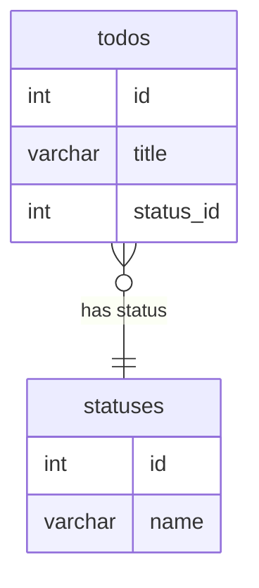

## 0. 課題説明
このTODOリストアプリバックエンド開発トレーニングでは、PHPとPostgreSQLを使用して、TODOリストアプリのバックエンドを開発する方法を学びます。主にRESTful APIを作成し、データベースとのやり取りを行います。
このトレーニングを通じて、次のスキルを習得できます：
- PHPを使用してRESTful APIを作成する。
- PostgreSQLデータベースとの通信を設定し、データの操作を行う。
- APIエンドポイントの作成方法を学び、データベースとの通信を実現する。 

トレーニングが完了すると、以下のようなAPIエンドポイントを作成できるようになります：
- タスクのリストを取得、作成、更新、削除する機能
- 各タスクの状態（`active`、`completed`、`pending`）を管理するAPI

## 1. 環境設定
構成図：


0. **(Mac/Linuxユーザーはスキップ) Windowsユーザー向けのWSL2追加設定 :** Windows Subsystem for Linux 2 (WSL2)を有効にしてください。参考：[WSL2の有効化](https://docs.microsoft.com/en-us/windows/wsl/install) , [Docker Desktop for Windows with WSL2](https://docs.docker.com/desktop/windows/wsl/)
1. **Dockerのインストール:** Dockerがインストールされ、実行されていること。([Docker Get Started](https://www.docker.com/get-started/))
2. **Docker Composeのインストール:** Docker Composeがインストールされていること。([Docker Compose Install](https://docs.docker.com/compose/install/))
3. **コードエディタ/IDEのインストール:** テキストエディタまたはIDE（例: VS Code）がインストールされていること。
4. **プロジェクトへの移動:** ターミナルを開き、`cd backend_training/`を使ってプロジェクトのルートディレクトリに移動してください。
5. **プロジェクトファイル:** `compose.yml`、`app/Dockerfile`、`app/src/`、および`nginx/default.conf`ファイルがあることを確認してください。

## 2. Dockerコンテナの起動

-    **Dockerコンテナの起動:** `docker compose up -d`コマンドを実行してコンテナを起動します。 
- `docker compose ps`またはDocker Desktopを使って、以下のコンテナが正常に起動していることを確認してください：
```bash
docker compose ps
NAME             IMAGE                  COMMAND                  SERVICE   CREATED      STATUS                  PORTS
2025winter-app   backend_training-app   "docker-php-entrypoi…"   app       7 days ago   Up 25 hours             0.0.0.0:9000->9000/tcp
2025winter-db    postgres:latest        "docker-entrypoint.s…"   db        7 days ago   Up 25 hours (healthy)   0.0.0.0:5432->5432/tcp
2025winter-web   nginx:latest           "/docker-entrypoint.…"   web       7 days ago   Up 25 hours             0.0.0.0:80->80/tcp
```
**TIPS:** コンテナが正常に起動していない場合、`docker compose logs <(任意)container-name>`を使用してログを確認してください。

## 3. データベースの設定
### 3.1.A. データベースクライアントで接続する場合
- **データベースクライアント:** PostgreSQLデータベースクライアント（`pgAdmin`、`DBeaver`など）がインストールされていること。
- **データベースへの接続:** `compose.yml`ファイルにある以下の接続情報を使って、PostgreSQLデータベースに正常に接続します。
  - HOST: localhost
  - DATABASE: 2025winterhackathon
  - PORT: 5432
  - USERNAME: prtimes
  - PASSWORD: 2025winter
### 3.1.B. CLIで接続する場合
- **`db`コンテナに接続:** `docker compose exec db bash`を使って`db`コンテナに接続します。
- **`psql`コマンド:** `psql -U prtimes -d 2025winterhackathon`を使って、PostgreSQLデータベースに接続します。

### 3.2 テーブルの作成
TODOリストアプリのデータベーススキーマを設計し、必要なテーブルを作成します。 以下のデータベース設計をもとに、todos テーブルと statuses テーブルを作成してください。

#### ER図 (データベース設計)
以下の ER図は、todos テーブルと statuses テーブルの関係を表しています。各 todo 項目には、status (状態) が関連付けられます。
<br />PostgreSQLに作成するテーブルの構造を以下の ER図を参考に作成してください。


- todos テーブル: TODOリストの項目を管理します。
- statuses テーブル: 各TODO項目の状態（例: "未完了", "進行中", "完了"）を管理します。
- リレーション: todos の status_id は、statuses の id を参照します (外部キー制約)。

<details>
  <summary>実行例</summary>

3.1.B. CLIで接続する場合を参考にPostgreSQLデータベースに接続後、以下のSQLクエリを実行してstatuses と todos の2つのテーブルを作成してください。
<br/>`statuses`テーブルの作成：
```sql
CREATE TABLE statuses (
    id SERIAL PRIMARY KEY,
    name VARCHAR(255) NOT NULL
);
```

<br />`todos`テーブルの作成：
```sql
CREATE TABLE todos (
    id SERIAL PRIMARY KEY,
    title VARCHAR(255) NOT NULL,
    status_id INT NOT NULL REFERENCES statuses(id)
);
```

</details>

### 3.3 データの挿入
-    **ステータスの挿入:** 以下のSQLクエリを実行して、`statuses`テーブルにデータを挿入します。
```sql
INSERT INTO statuses (name) VALUES
    ('pending'),
    ('completed'),
    ('active');
```
-    **事前タスクの挿入:** 以下のSQLクエリを実行して、`todos`テーブルにデータを挿入します。
```sql
INSERT INTO todos (title, status_id) VALUES
    ('Todo 1', 1),
    ('Todo 2', 2),
    ('Todo 3', 1),
    ('Todo 4', 3);
```

### 3.4 データの確認
**SQLクエリの実行:** 以下のSQLクエリを実行して、`todos`テーブルと`statuses`のデータを確認します。ステップ3.3で挿入したデータが表示されることを確認してください。
```sql
SELECT todos.id, todos.title, statuses.name
FROM todos 
  JOIN statuses 
    ON todos.status_id = statuses.id;
```
以下のような結果が表示されると、OKです。
```bash
 id | title  |   name    
----+--------+-----------
  1 | Todo 1 | pending
  2 | Todo 2 | completed
  3 | Todo 3 | pending
  4 | Todo 4 | active

(4 rows)
```

## 4. PHP API の開発

1. **`config.php`の作成:**  
   `app/src`ディレクトリに、データベース接続設定を含む`config.php`ファイルを作成します。 （今回はサンプルとして作成済みです）

2. **`index.php`の作成:**  
   同じディレクトリに`index.php`ファイルを作成し、`/todos`エンドポイントを実装します。 （今回はサンプルとして作成済みです）
   <br>APIエンドポイントの実装には、すべてのコードを1つのファイルに書く必要はありません。できるだけコードをモジュール化し、各機能を異なるファイルに分けて実装することをお勧めします（例えば、TodoクラスやDatabaseクラスなど）。
   <br><br>以下のJSON APIのエンドポイントをそれぞれ実装してください：

    - **GET `/todos`（全てのTodoを取得）:**
        - サンプルとして実装済みです
        - 成功時: HTTPステータスコード`200`で全てのTodoをJSON形式で返します。Todoが存在しない場合、空の配列`[]`を返します。
          - 例：<br> 
            ```json
            {
                "status": "ok", 
                "data": [
                    {"id": 1, "title": "Todo 1", "status": "pending"},
                    {"id": 2, "title": "Todo 2", "status": "completed"},
                    {"id": 3, "title": "Todo 3", "status": "pending"},
                    {"id": 4, "title": "Todo 4", "status": "active"}
                ]        
            }
            ``` 
        - エラー時: HTTPステータスコード`500`でエラーメッセージを`{"error": "エラーメッセージ"}`の形式で返します。

    - **GET `/todos/{id}`（IDでTodoを取得）:**
        - 成功時: HTTPステータスコード`200`で指定されたIDのTodoをJSON形式で返します。Todoが存在しない場合、空のオブジェクト`{}`を返します。
        - IDが見つからない場合: HTTPステータスコード`404`でエラーメッセージ`{"error": "Todoが見つかりません"}`を返します。
        - エラー時: HTTPステータスコード`500`でエラーメッセージを返します。

    - **POST `/todos`（新しいTodoを作成）:**
        - リクエストボディとして`{"title": "Todoのタイトル"}`のJSONを受け付けます。
        - 成功時: HTTPステータスコード`201`で作成されたTodoをJSON形式で返します。
        - エラー時: HTTPステータスコード`500`でエラーメッセージを返します。

    - **PUT `/todos?id={id}`（IDでTodoを更新）:**
        - リクエストボディで`title`または`completed`ステータスを更新します。
        - 成功時: HTTPステータスコード`200`で更新されたTodoをJSON形式で返します。
        - IDが見つからない場合: HTTPステータスコード`404`でエラーメッセージを返します。
        - エラー時: HTTPステータスコード`500`でエラーメッセージを返します。

    - **DELETE `/todos?id={id}`（IDでTodoを削除）:**
        - 成功時: HTTPステータスコード`200`で削除されたTodoをJSON形式で返します。
        - IDが見つからない場合: HTTPステータスコード`404`でエラーメッセージを返します。
        - エラー時: HTTPステータスコード`500`でエラーメッセージを返します。

## 5. APIのテスト

### BashスクリプトでのAPIテスト

テストを簡単に行いたい場合、以下のBashスクリプトを使用して、APIエンドポイントを自動的にテストできます。このスクリプトでは、各APIエンドポイントを呼び出して、結果が期待通りかを確認します。

**Bashスクリプトの使用方法:**

0. WSL2を使用している場合、Ubuntuはjqがインストールされていない場合があります。以下のコマンドを使用してjqをインストールしてください：

   ```bash
   sudo apt-get install jq
    ```
   
1. スクリプトをダウンロードまたは作成し、`test_api.sh`という名前で保存します。

2. 以下のコマンドで実行します：

   ```bash
   bash bin/test_api.sh
    ```
   
3. スクリプトが実行されると、各APIエンドポイントのテスト結果が表示されます。
テストのオプションは、個別のエンドポイントを選択して実行するか、「Run All Tests」を選んで全てのテストを一度に実行できます。

   ```bash
   bash bin/test_api.sh
   1) Test GET /todos              6) Test DELETE /todos?id=1
   2) Test GET /todos?id=1         7) Test GET /todos/cause-error
   3) Test GET /todos?id=9999      8) Run All Tests
   4) Test POST /todos             9) Exit
   5) Test PUT /todos?id=1
   ```
   
4. テスト実行の確認: スクリプトが正しく実行されると、各APIエンドポイントの結果がターミナルに表示されます。成功した場合は「✅ Passed」と表示され、失敗した場合は「❌ Failed」と表示されます。
   ```bash
     Testing GET /todos (Retrieve all Todos)
     ✅ Passed
     Response: {"status":"ok","todos":[{"id":4,"title":"Todo 4","status_id":3},{"id":3,"title":"Todo 3","status_id":1},{"id":2,"title":"Todo 2","status_id":2},{"id":1,"title":"Todo 1","status_id":1}]}
   ```
   
   ```bash
     Testing GET /todos?id=1 (Retrieve Todo by ID)
     ❌ Failed
     Response: {"status":"ok","todos":[{"id":4,"title":"Todo 4","status_id":3},{"id":3,"title":"Todo 3","status_id":1},{"id":2,"title":"Todo 2","status_id":2},{"id":1,"title":"Todo 1","status_id":1}]}
   ```

### 手動でのAPIテスト方法

1. **GET /todos (リストの取得):**
    - `GET`メソッドを使用して `http://localhost/todos` をリクエストし、空の配列 `[]` が返されることを確認します。これは、まだタスクがデータベースに存在しない場合に期待されるレスポンスです。

2. **POST /todos (新しいTodoの作成):**
    - `POST`メソッドを使用して `http://localhost/todos` にリクエストを送り、以下のようなJSONボディを提供します:
      ```json
      {"title": "テストTodo"}
      ```
    - 新しいTodoレコードがデータベースに正しく作成され、タイトルが期待通りであることを確認します。

3. **GET /todos?id={id} (特定のTodoを取得):**
    - `GET`メソッドを使用して `http://localhost/todos?id={id}` にリクエストを送り、`{id}` を作成したTodoのIDに置き換えます。
    - レスポンスとして、正しいTodoレコードが返されることを確認します。

4. **PUT /todos?id={id} (Todoの更新):**
    - `PUT`メソッドを使用して `http://localhost/todos?id={id}` にリクエストを送り、`{id}` を既存のTodo IDに置き換えます。
    - リクエストボディで `title` や `status`（例: "completed"）を更新し、レスポンスとして更新されたTodoが返されることを確認します。

5. **DELETE /todos?id={id} (Todoの削除):**
    - `DELETE`メソッドを使用して `http://localhost/todos?id={id}` にリクエストを送り、`{id}` を削除したいTodoのIDに置き換えます。
    - レスポンスとして削除されたTodoが返され、データベースからそのTodoが削除されていることを確認します。

<br>上記のAPIリクエストは、**Postman**や**Insomnia**などのAPIクライアントを使用して手動で送信できます。これらのツールを使えば、リクエストヘッダやボディをカスタマイズして、より柔軟にAPI
をテストできます。  
APIクライアントを使用すると、リクエストとレスポンスを可視化し、デバッグも簡単に行えます。どのAPIクライアントでも、必要に応じてリクエストを作成し、APIの動作を確認できます。

## おめでとうございます！
5のAPIエンドポイントを全て実装してテストが通ることを確認できたら、バックエンド課題は完了です！  
フロントエンド課題で作成した画面とのつなぎ込みや作成したコードのリファクタリングなどにもチャレンジしてみましょう。
